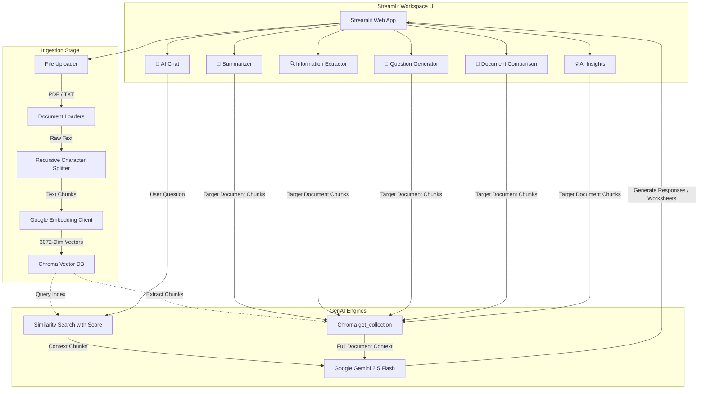
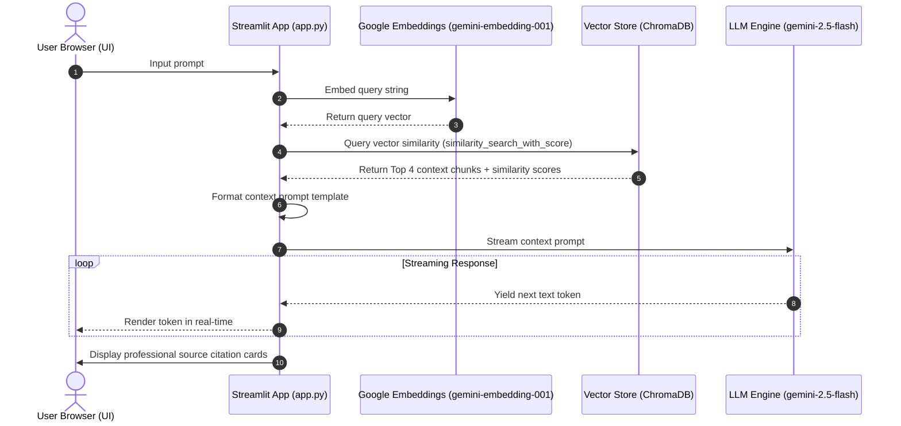

# 💬 VectorMind AI (RAG)

An enterprise-ready, Docker-free **Retrieval-Augmented Generation (RAG)** application designed to ingest PDF and TXT documents, perform similarity vector searches, and deliver highly accurate, contextual answers. Powered by **Streamlit**, **LangChain**, **Google Gemini**, and **ChromaDB**.

---

## 📌 Project Overview
The **VectorMind AI** is a streamlined solution that demonstrates state-of-the-art information extraction and retrieval. By combining Google's advanced semantic embeddings and LLMs with a local vector database, the application overcomes typical AI limitations such as hallucinations and outdated knowledge bases. 

It is designed for rapid local deployment (zero-Docker requirement) while maintaining clean architectural abstractions that facilitate enterprise scaling.

---

## 🚀 Key Features
- **Multi-Function Workspaces (Tabs)**: Organized into 6 premium workspaces: AI Chat, Summarizer, Information Extractor, Question Generator, Document Comparison, and AI Insights.
- **Smart Document Summarizer**: Generate Executive, Detailed, or Bullet-point summaries dynamically from any selected document in the vector database.
- **Key Information Extractor**: Automatically extract technical tools, professional skills, key timeline dates, and major organizations/locations into clean structured layouts.
- **Educational Question Generator**: Generate quiz questions, interview preparation answers, or multiple-choice questions (MCQs) directly from document contents.
- **Document Comparison Workspace**: Side-by-side analysis of two separate documents to identify similarities, differences, and unique attributes.
- **AI Insights & Actions Panel**: Formulate main themes, strategic takeaways, and recommended action steps.
- **Multiple Document Collections**: Isolated index spaces representing separate knowledge domains (**Resume Collection**, **Research Papers Collection**, **Project Reports Collection**, and **General Documents Collection**).
- **Persistent Query Analytics**: Dynamic dashboard visualizing production key metrics (Total Uploaded Documents, Total Chunks Created, Total Embeddings Stored, Total User Queries, and Average Response Time latency) saved locally in `data_store.json`.
- **Multi-Format Conversational Exporters**: One-click chat backups in Markdown (`.md`) and Plain Text (`.txt`) complete with timestamp headers, role indicators, page counts, and context source citations.
- **Dynamic File Ingestion**: Real-time text extraction and chunking of PDF and TXT files directly through the frontend dashboard.
- **Local Persistence & State Safety**: Uses ChromaDB for vector storage with integrated Windows-lock safety, automatic garbage collection, and safe database client unloading.
- **Incremental Indexing**: Detects existing vector databases and appends new content dynamically instead of re-indexing from scratch.
- **Vibrant Premium UI**: Custom CSS styled dark-gradient theme featuring glassmorphic components, micro-animations, and styled file drop zones.
- **Real-Time Streaming**: Word-by-word response streaming (SSE) using Gemini's latest API.
- **Granular Source Citations**: Collapsible context viewer displaying raw retrieved chunks alongside metadata, file names, page numbers, and exact similarity (L2 distance) scores.

---

## 🏗️ Architecture Design

The following diagram illustrates the components and interactions of the **VectorMind AI** RAG pipeline:



---

## 🔄 Sequence Workflow

The sequential steps from a user's question to the final streaming response are detailed below:



---

## 🧠 RAG & Tech Integration Explained

### 1. Retrieval-Augmented Generation (RAG)
Large Language Models are static, frozen in time at the end of their training cycle. RAG bridges this knowledge gap by dynamically injecting relevant external information into the query context window at runtime. The workflow splits into two distinct paths:
- **Write Path (Indexing)**: Custom text is extracted, split into overlapping chunks, vectorized using embedding models, and index-mapped into a vector database.
- **Read Path (Retrieval & Synthesis)**: User input is vectorized, matching document chunks are searched from the database via mathematical distance calculations, and both context and question are fused into a master prompt sent to the LLM.

### 2. Gemini + ChromaDB Integration
- **Semantic Vector Space**: Using Google's `gemini-embedding-001` model, text segments are mapped to high-quality `3072`-dimensional vector spaces, capturing rich semantic relationships and deep context.
- **Distance Metric Search**: ChromaDB calculates vector similarities using L2 Euclidean Distance. Our app uses `db.similarity_search_with_score(query, k=4)` to extract matching vectors. 
- **Generation Engine**: The prompt is processed by `gemini-2.5-flash`, which offers excellent throughput, large context processing capability, and near-instant streaming generation.

---

## 💻 Installation Steps

### 1. Prerequisites
Ensure you have **Python 3.9 - 3.11** installed.

### 2. Set Up Environment
```bash
# Clone the repository
git clone <repository_url>
cd simple_chatqna

# Create and activate virtual environment
python -m venv venv
# On Windows (cmd):
venv\Scripts\activate.bat
# On Windows (PowerShell):
venv\Scripts\Activate.ps1
# On Linux/macOS:
source venv/bin/activate
```

### 3. Install Requirements
```bash
pip install --upgrade pip
pip install -r requirements.txt
```

### 4. Configure API Key
Create a `.env` file in the root of the `simple_chatqna/` directory:
```env
GEMINI_API_KEY=your_google_gemini_api_key_here
```

### 5. Launch Application
```bash
python -m streamlit run app.py
```

---

## 💡 Usage Examples

1. **Document Upload**:
   - Drag a research PDF (e.g. `quarterly_earnings.pdf`) into the sidebar file uploader.
   - Click **Index Documents ⚡**.
2. **Context-Aware Querying**:
   - In the chat input, type: `"What was the net profit margin for Q3?"`
   - Observe the assistant stream the answer and render citation cards containing page number, document source name, similarity distance, and the referenced text excerpt.

---

## 🖼️ User Interface Mockups

Below is an ASCII representation of the premium AI SaaS dashboard interface:

```
+-------------------------------------------------------------------------------------------------------+
|  🤖 VECTORMIND AI                                                                            |
|  "Powered by RAG and Semantic Search"                                                   |
+-------------------------------------------------------------------------------------------------------+
|  [v] 📊 SYSTEM DASHBOARD & ANALYTICS                                                                  |
|  +-------------------+--------------------+--------------------+-------------------+-----------------+ |
|  | Total Docs: 3     | Total Collections:4| Total Chunks: 142  | Total Queries: 12 | Avg Latency: 1.4s| |
|  +-------------------+--------------------+--------------------+-------------------+-----------------+ |
|  | [ Bar Chart: Chunks per Collection ]                 [ Line Chart: Query Latency History ]        | |
|  +---------------------------------------------------------------------------------------------------+ |
+------------------------------------+------------------------------------------------------------------+
| 🤖 VectorMind AI          |  [ 💬 AI Chat ]  [ 📝 Summarizer ]  [ 🔍 Info Extractor ] ...    |
| "Powered by RAG and..."      | +--------------------------------------------------------------+ |
|                                    | | 👤 User: What is the main thesis?                            | |
| 📂 Active Collection               | | +----------------------------------------------------------+ | |
| [ Research Papers Collection  [v] ]| | | The user chat bubble is slate/blue, aligned right.       | | |
|                                    | | +----------------------------------------------------------+ | |
| 📁 Ingest Documents                | +--------------------------------------------------------------+ |
| [ Drag & Drop PDF/TXT here ]       | +--------------------------------------------------------------+ |
|                                    | | 🤖 Assistant: The main thesis is...                          | |
| 📚 Indexed Documents               | | +----------------------------------------------------------+ | |
| 📄 quarterly_earnings.pdf          | | | The assistant bubble is dark with a blue border.         | | |
| 📝 summary.txt                     | | |                                                          | | |
| [ Clear Vector DB 🗑️ ]             | | | 📚 Source Citations:                                     | | |
|                                    | | | [1] quarterly_earnings.pdf • Page 2 • Distance: 0.1240   | | |
| 📥 Export Workspace                | | | "The net profit margin increased by..."                  | | |
| [ Markdown 📄 ]  [ Plain Text 📝 ]  | | +----------------------------------------------------------+ | |
|                                    | +--------------------------------------------------------------+ |
| ⚙️ Gemini API Configuration         | [ Ask a question about your documents...                     ]   |
+------------------------------------+------------------------------------------------------------------+
```

---

## 🔮 Future Enhancements
- **Hybrid Keyword Search (BM25)**: Combine vector similarity searches with keyword-matching algorithms for optimal retrieval.
- **Multimodal RAG**: Support images, audio files, and charts using Gemini Multimodal Embeddings.
- **Prompt Guardrails**: Implement Llama Guard or NeMo Guardrails to protect against prompt injection attacks.
- **Automated Evaluations**: Integrate Ragas and LangSmith to run automated metrics checks on retrieval accuracy and generation quality.

---

## 📄 ATS-Friendly Resume Description

**Generative AI Developer / RAG Engineer**
- Designed and built a container-free Retrieval-Augmented Generation (RAG) web application using Streamlit, LangChain, and ChromaDB, optimizing response latencies by leveraging Google's **Gemini 2.5 Flash** API.
- Implemented a multi-collection document store with isolated SQLite/ChromaDB directories, allowing users to index and search across discrete domains (Resumes, Research, Reports, General) in a single interface.
- Developed a local persistent JSON analytics engine to track production KPIs (total documents, chunks generated, embeddings count, query volume, and millisecond-level response latencies), displaying live metrics via custom UI cards.
- Engineered a modular chat history export interface that compiles streamed conversations with page-number indicators, source documents, and distance-similarity scores into Markdown (`.md`) and Text (`.txt`) file backups.
- Implemented stateful resource management to release SQLite handles, resolving Windows-specific file-locking conflicts (`PermissionError`), and increasing system stability during database clearing operations.
- Built an incremental ingestion pipeline that detects pre-existing databases and appends new document vectors (yielding up to `3072` dimensions via `gemini-embedding-001`) instead of executing full-recreation cycles, saving API quota costs.
- Developed an interactive streaming UI highlighting real-time LLM token output accompanied by detailed card-based source citations with page numbers, document source names, and vector distance values.

---

## 🛠️ Technical Skills Demonstrated
- **Frameworks & Orchestrators**: LangChain, Streamlit, PyPDF, Python-Dotenv, JSON Persistence
- **Vector Search & DBs**: ChromaDB, SQLite, Path Isolation, L2 Distance Metrics, Vector Space Geometry
- **Large Language Models**: Google Gemini 2.5 Flash (`ChatGoogleGenerativeAI`), Semantic Embeddings (`gemini-embedding-001`)
- **Software Engineering**: Resource Management (Unloading/Garbage Collection), Exception Handling, Windows File-lock Mitigations, Conversational Log Formatting, Mermaid Visualization
